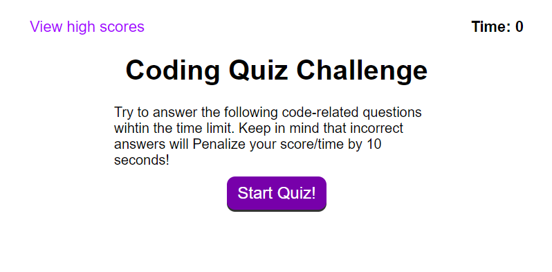

# Coding Quiz

## Description
The website will give the user a timed quiz randomly pulling from a set of questions ending when all questions are answered or time runs out. Highscores will be saved and displayed as well.

 https://spyromancy.github.io/coding-quiz/

## Contributing

This is a graded class project, as such I will not be accepting any outside contributions.
